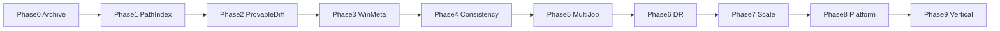
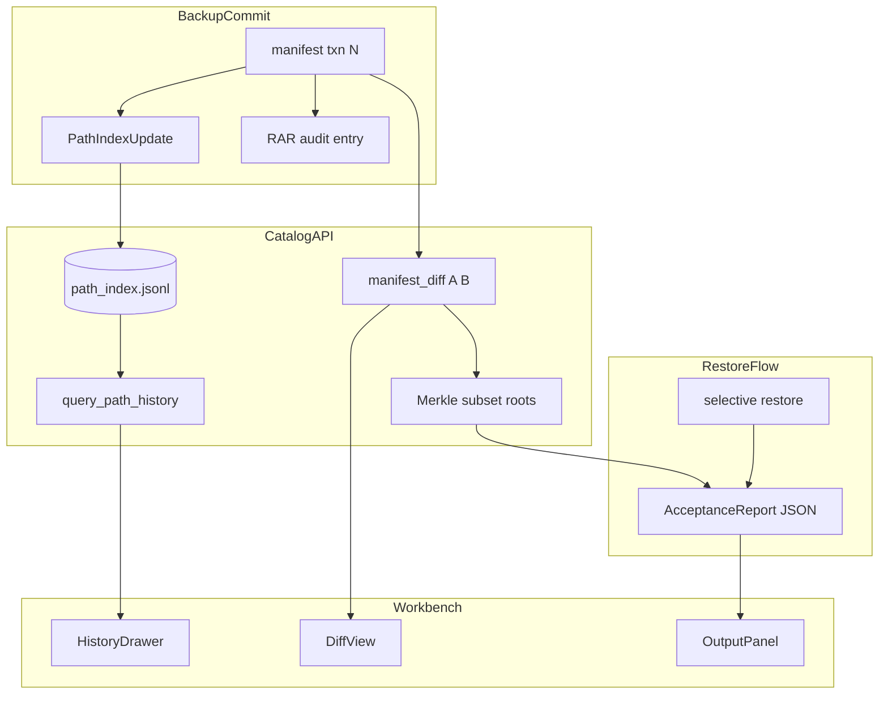

# 备份能力创新路线图（工程）

产品缺口表见 [BACKUP_CAPABILITY_GAPS.md](../product/BACKUP_CAPABILITY_GAPS.md)。

---

## 阶段依赖

---

## Phase 0 — 归档与治理

| 交付 | 路径 |
|------|------|
| 缺口表 | `docs/product/BACKUP_CAPABILITY_GAPS.md` |
| 路线图 | `docs/technical/CAPABILITY_ROADMAP.md` |
| 索引 | `docs/README.md` |
| ABI 占位 | `docs/technical/ABI_AND_FEATURES.md` § 规划中 ABI |

---

## Phase 1 — 文件版本史索引（ABI v14）

**缺口**：GAP-CATALOG-01, GAP-CATALOG-04（基础）

### 引擎

| 文件 | 职责 |
|------|------|
| `engine_cpp/include/ebbackup/catalog/path_index.h` | PathIndexRecord, build/query API |
| `engine_cpp/src/catalog/path_index.cc` | JSONL sidecar `catalog/path_index.jsonl` |
| `engine_cpp/tests/engine/path_index_test.cc` | 多 txn 同路径变更 |

### C API（v14）

- `eb_backup_build_path_index`
- `eb_backup_query_path_history_json`
- `eb_backup_list_manifest_files_page_json`

### Workbench / GUI

- `engine_cpp/workbench/ebbackup_workbench.def` 导出
- `gui/src/components/PathHistoryDrawer.vue`
- `BrowseView.vue` 路径历史入口

### 测试门禁

- `path_index_test.cc` 单元
- `workbench_integration.rs` history roundtrip

---

## Phase 2 — Merkle 可证明 Diff + 恢复验收（ABI v15）

**缺口**：GAP-CATALOG-02/03, GAP-RESTORE-03, GAP-CATALOG-05（部分）

### 引擎

| 文件 | 职责 |
|------|------|
| `engine_cpp/include/ebbackup/catalog/manifest_diff.h` | SnapshotDiffResult |
| `engine_cpp/src/catalog/manifest_diff.cc` | added/removed/modified + Merkle |
| `engine_cpp/include/ebbackup/catalog/restore_acceptance.h` | RestoreAcceptanceReport |
| `engine_cpp/src/catalog/restore_acceptance.cc` | JSON export |

### C API（v15）

- `eb_backup_diff_snapshots_json`
- `eb_backup_export_restore_report_json`

### CLI

- `eb diff --at A --at B`
- `eb restore ... --acceptance-report out.json`

### GUI

- `gui/src/activities/DiffView.vue`
- Restore 完成 → OutputPanel 验收报告 tab

---

## Phase 3 — Windows 元数据保真（ABI v16）

**缺口**：GAP-WIN-01~04

- Manifest v5：`security_descriptor_b64`, `inode_id`, `reparse_tag`, `reparse_target`, `stream_name`
- `engine_cpp/src/winmeta/win_meta.cc`（扫描/恢复）
- GUI 恢复选项：ACL 策略 + 联接点恢复策略

### Wave E 深化（Phase 3 done）

| 交付 | 路径 |
|------|------|
| 硬链 dedup | `backup_engine.cc` — `inode_id` 去重 chunk；`CreateHardLinkW` 恢复 |
| Junction | `win_meta.cc` — `reparse_target` 采集 + `RecreateReparsePoint` |
| ACL best_effort | `ApplyWinMetaOnRestore` + 验收报告 `issues[]` |
| ADS | `ReadFileBytes` / `CreateFileW` 读写 alternate stream |
| GUI | `RestoreView.vue` — ACL 四值 + 联接点 skip/recreate |
| 测试 | `hardlink_backup_restore_test` / `acl_restore_test` / `win_reparse_scan_test` / `ads_backup_restore_test` |

---

## Phase 4 — 尽力一致备份（ABI v17）

**缺口**：GAP-CONSIST-02/03, GAP-ENGINE-01, GAP-CATALOG-05

### Completion（Wave C）

| 交付 | 路径 |
|------|------|
| 扫描容错 | `scan_entry.cc` — `ScanResult`、深度上限、issue 收集 |
| WIN-03 | reparse 目录不递归；恢复跳过 `reparse_tag` 目录 |
| 备份报告 | `reports/<txn>.json` — Load/ToJson + commit 填充 |
| Hooks | `hook_runner.cc` — `pre_backup_cmd` / `post_backup_cmd` |
| ABI v17 | `eb_backup_get_backup_report_json` |
| CLI | `eb backup --pre-cmd` / `--post-cmd`；`eb report --at TXN` |
| GUI | OutputPanel「备份报告」页签 + BackupView 拉取 |
| 测试 | `backup_report_test` / `scan_errors_test` / `win_reparse_scan_test` / workbench IT |

### Wave D 深化（Phase 4 done）

| 交付 | 路径 |
|------|------|
| Issue 路径跳过 chunk | `ScanFiles` issue set + `ChunkPendingFiles` 读失败 skip |
| Pipeline 尽力一致 | `ReaderStage` per-path skip → `scan_issues_` |
| 报告分桶 | `PopulateReportIssueCounts` + `reparse_junction` / `hook_failed` |
| Hook C API | `eb_backup_set_backup_hooks` + Workbench + BackupView 高级区 |
| GUI 报告面板 | `BackupReportPanel.vue` 摘要 + issues 表格 |

**明确不做**：VSS（GAP-CONSIST-01）

---

## Phase 5 — 多 Job 与策略（ABI v18） ✅

**缺口**：GAP-JOB-01~04（**已关闭**，Wave F）

- `jobs.json` CRUD + `eb job` / `eb backup --job` CLI
- `BackupEngine::RunJob`：按 Job 源路径与 `exclude_globs` 备份
- `catalog/snapshot_meta.jsonl`：`job_id`、`retention_tag`、`immutable_until_unix`
- Prune：`immutable_until` 保护 + WORM repo 需 audit 授权
- C API：`eb_backup_list/upsert/delete/run_job`（`EB_BACKUP_ABI_VERSION` 18）
- **GUI Job 管理**（Wave G）：`BackupView` 作业 CRUD/运行；快照/报告展示 `job_id` 与 WORM；Prune audit key
- **未含**：GAP-JOB-05 备份窗口

---

## Phase 6 — 灾备闭环 ✅

**缺口**：GAP-RESTORE-01、GAP-RESTORE-04 — **已闭合（Wave M）**

- **已落地**：就地恢复 preview + apply + orphan policy（`--in-place-orphans skip|delete`；Workbench/GUI）
- **已落地**：三路合并（base/target/live）；`--base-at`；`both_changed` 分类；`overwrite` 对 conflict/both_changed 生效
- **已落地**：`--dry-run` 就地 apply；`overwritten_count` 统计
- **已落地**：Symlink 目标 remap（`--symlink-remap-from/to`；remap JSON `symlink_remap_from/to`）
- **已落地**：RestoreView 就地模式（Base 选择器、冲突筛选、bulk 决议、Dry-run）
- **已落地**：`ebrecover` 最小 runtime
- **已落地**：EBB v2 delta bundle + C API v21（`eb_backup_export/import/apply_delta_json`）+ GUI 导出入口
- **已落地**：Pipeline Sprint 5 Hybrid CDC（默认启用；`EBBACKUP_CDC_HYBRID=0` opt-out；bench `hybrid_stream_ratio` ≥ 0.95）

---

## Phase 7 — 规模与韧性

**缺口**：GAP-CATALOG-04 完整, GAP-ENGINE-02/03 — **已闭合（Wave L）**

- **已落地**：Manifest browse sidecar（`catalog/manifest_browse/<txn>.mbi`）+ 流式 binary 迭代 rebuild
- **已落地**：`ListManifestFilesPageJson` sidecar 优先 + `index_source` 调试字段
- **已落地**：持久化 Job 队列（`catalog/job_queue.jsonl`）+ `eb queue` + C API v22
- **已落地**：扫描深度上限 + symlink 循环检测集成测试

---

## Phase 8 — 平台与合规

**缺口**：GAP-PLATFORM-01/02 — **已闭合（Wave O+）**

- **已落地（Wave N）**：增量链可达性 JSON + `eb verify-chain`；RPO 合规摘要 + GUI 卡片；Job 队列 GUI + daemon `queue_drain`；本地备份滞后告警 MVP
- **已落地（Wave O）**：孤儿解释 JSON + Maintenance 解释图；GUI 破坏性操作 ops 审计 → RAR（`eb audit-ops list`）
- **已落地（Wave O+）**：Windows Service / systemd 模板 + `eb service` CLI；daemon 可中断 stop；Workbench 多 Profile（主题、最近仓库、告警分 profile 持久化）

---

## Phase 9 — 垂直插件

**缺口**：GAP-VERTICAL-01~03 — **已闭合（Wave P）**

- **已落地**：`IBackupPlugin` 接入 `RunBackup`（Quiesce/ExtraScanRoots/ScanHints/Thaw）
- **已落地**：`sqlite_checkpoint` / `registry_hive` / `vhdx_scan` 三内置插件
- **已落地**：`jobs.json` `plugins[]`；CLI `eb plugin list` / `eb backup --plugins`；GUI 备份页/作业插件多选

**Wave Q — 插件打磨（仍 ABI v27）**

- **已落地**：备份报告 `plugins[]` + `plugin_skipped`/`plugin_failed`；GUI `BackupReportPanel` 插件摘要表
- **已落地**：daemon/schedule `plugins=` 逗号配置；VHDX 条件 E2E gtest（Hyper-V 不可用时 skip）

---

## Phase 10 — 智能排除

**缺口**：GAP-JOB-02 — **已闭合（Wave R）**

- **已落地**：`SuggestExcludeFilters` 浅扫描 + catalog（`.git`、`node_modules`、`Thumbs.db` 等）
- **已落地**：`jobs.json` `exclude_paths[]` + `RunJob` 合并；CLI `eb suggest-excludes`；C API `eb_backup_suggest_exclude_filters_json`（ABI v28）
- **已落地**：GUI 备份页「分析源目录」+ 建议表格 + 一键采纳（作业持久化或 ad-hoc `setFilterJson`）

---

## Phase 11 — 备份窗口

**缺口**：GAP-JOB-05 — **已闭合（Wave T）**

- **已落地**：`jobs.json` `window_start/end` + `deadline_grace_seconds` + `durability_adaptive`
- **已落地**：`RunJob` 窗外 Conflict；queue drain 跳过；接近 deadline 降级 durability；超时截断 + 报告字段（ABI v29）
- **已落地**：GUI 作业对话框备份窗口区 + 备份报告展示

---

## Phase 12 — 外侧云生态（非内核） ✅

**原则**：**不进 ABI v30**；网络与远端状态全部在 [`sync_cpp/`](../../sync_cpp/)。

| 交付 | 路径 |
|------|------|
| 冻结与架构 | `docs/technical/CLOUD_ECOSYSTEM.md` |
| 同步运行时 | `sync_cpp/` — `eb-sync` CLI |
| 状态 | `{repo}/catalog/sync_state.json`、`sync_outbox.jsonl` |
| 轨道 A | EBB v2 delta + `sync_ferry.example.json` + GUI Sync Activity |
| 轨道 B | S3 transport + SyncAgent push/drain + `sync_drain.example.json` |
| Daemon | `mode=sync_drain` → 子进程 `eb-sync push --drain`（无内核网络代码） |
| GUI | `SyncView.vue`、`useBackupAlerts` stale_sync、Tauri `sync_*` commands |

### 子阶段

1. **12a 无云本地闭环** ✅：`init --local-mirror` / `--mode ferry`、ferry import、本地 pull、维护门控按模式、E2E 测试、GUI 同步方式向导
2. **12b 文档与摆渡**：CLOUD_ECOSYSTEM、ferry 示例、Workbench delta 向导
3. **12c sync_cpp 基础**：sync_state、outbox、ebb_reader、SyncAgent
4. **12d S3 传输（可选）**：WinHTTP + SigV4（Windows）；本地目录 transport 用于无云测试
5. **12e Sync Agent**：push / plan / status / verify-remote / pull
6. **12f 可观测与门控**：SyncView、compact 前警告、stale_sync 告警

> **无云起步**：优先 12a（摆渡 + 本地镜像）；S3 在线同步待有云环境后再验。

---

## ABI 演进约定

| Phase | ABI | 新增 |
|-------|-----|------|
| 1 | v14 | path index build/query, manifest page |
| 2 | v15 | snapshot diff, restore acceptance export |
| 3 | v16 | manifest v5 meta extensions |
| 4 | v17 | backup report JSON, pre/post hooks |
| 5 | v18 | multi-job config API |
| 6 | v19 | in-place preview JSON, job report sidecar |
| 6 | v20 | in-place apply JSON, Hybrid CDC default-on |
| 6 | v21 | delta bundle C API, in-place orphan policy, symlink remap JSON |
| 7 | v22 | manifest browse sidecar, job queue C API/CLI |
| 6 | v23 | in-place three-way merge, dry-run, overwrite semantics, bulk conflict GUI |
| 8 | v24 | snapshot reachability JSON, RPO summary JSON, queue drain daemon/GUI, stale backup alerts |
| 8 | v25 | orphan explain JSON, GUI ops audit → RAR, CLI orphan-explain / audit-ops list |
| 8 | v26 | Windows Service + systemd templates, daemon graceful stop, Workbench multi-profile |
| 9 | v27 | vertical backup plugins, job plugins[], eb plugin list |
| 9 | v27 | Wave Q: report plugins[], GUI summary, schedule plugins=, VHDX E2E |
| 10 | v28 | smart exclude suggestions, job exclude_paths[], eb suggest-excludes, GUI analyze/adopt |
| 11 | v29 | backup window, deadline durability adaptive, report window_truncated |
| 12 | — | **无新 ABI**；云生态在 `sync_cpp/` |

每 Phase 合并前更新：`ABI_AND_FEATURES.md`、`engine_cpp/README.md`、`gui/src/utils/helpContent.ts`。

---

## Phase 1–2 架构

